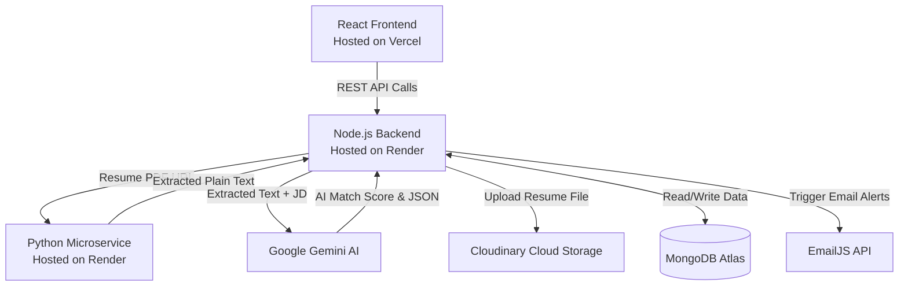

# AI-Powered Applicant Tracking System (ATS)

## Project Overview
The Zaalima AI-Powered Applicant Tracking System (ATS) is an end-to-end recruitment platform designed to streamline the hiring process. Built for "Project 3" of the Zaalima Internship, this application empowers recruiters to manage job postings and candidates using a visual Kanban pipeline, while candidates can securely upload their resumes to apply. 

The core feature of this platform is the integration of **Google Gemini AI**, which automatically parses PDF resumes, extracts structured data (skills, experience, education), and evaluates candidates against job descriptions to provide recruiters with an intelligent, bias-free "Match Score".

## Day-Wise Progress Report

* **Day 1-3 (Database & Auth):** Designed the MongoDB schema structure for Users, Jobs, and Applications. Implemented secure JWT-based dual-role authentication (Recruiters vs. Candidates) and password hashing via `bcryptjs`.
* **Day 4-5 (Job Management):** Developed the Recruiter dashboard and core REST APIs to create, edit, view, and archive job postings securely.
* **Day 6-7 (Job Board & UI):** Built the public-facing Job Board and Candidate Dashboard using React and Material-UI, ensuring clean, responsive navigation.
* **Day 8-10 (Resume Uploads & UI):** Configured secure file handling using `multer`. Allowed candidates to upload PDF/DOCX resumes and submit applications directly linked to job listings.
* **Day 11-12 (AI Engine & Email Integration):** Integrated Google Gemini API for intelligent resume parsing and semantic matching against Job Descriptions. Set up Nodemailer to automatically send real-time email notifications for status changes and interview invitations.
* **Day 13-14 (Cloud Migration & Microservices):** Migrated local database to MongoDB Atlas and local file storage to Cloudinary to make the app production-ready. Built a Python Flask microservice to handle heavy PDF/DOCX text extraction, offloading heavy processing from the Node.js main thread.
* **Day 15 (Interactive Workflows & UI Polish):** Implemented two-way interactive workflows allowing candidates to explicitly Accept/Decline interviews and offers from a redesigned modern dashboard. Overhauled the Recruiter Kanban Board with smart action buttons, detailed JD-based AI Breakdown dialogs, and a clean, user-friendly aesthetic.
* **Day 16 (Deployment & Email Integrations):** Deployed the application stack to production using Render (Node.js & Python Microservice) and Vercel (React Frontend) with dynamic environment variable routing. Replaced Nodemailer with the EmailJS REST API for reliable, secure, serverless email delivery of interview invitations and status updates.

## Features
1. **Secure Dual-Role Authentication:** Separate roles and capabilities for Recruiters and Candidates.
2. **Recruiter Portal:** Dashboard to create, edit, archive, and manage job postings.
3. **Candidate Portal:** Dashboard to track personal application history and respond to interview/job offers.
4. **Public Job Board:** A clean, accessible view of all active job openings.
5. **Secure Cloud Resume Upload:** File validation (PDF/DOCX) and cloud storage integration via Cloudinary.
6. **Application Pipeline (Kanban):** Interactive drag-and-drop board for recruiters with smart 1-click action buttons to move candidates between stages.
7. **AI Candidate Matching:** Google Gemini evaluates candidate resumes strictly against the Job Description, providing a 0-100 score, matched/missing skills, and an explicit breakdown summary.

## Tech Stack
* **Frontend:** React.js, React Query, Material UI (MUI), Vite
* **Backend:** Node.js, Express.js
* **Microservice:** Python, Flask, PyMuPDF
* **Database:** MongoDB Atlas, Mongoose
* **Cloud Storage:** Cloudinary

## System Architecture
The application follows a standard MERN stack architecture, enhanced with a Python Microservice and serverless integrations. The Node.js backend serves as the core API, enforcing role-based authorization. Heavy tasks (like PDF parsing and AI processing) are offloaded to external services to keep the main thread fast.



## Environment Variables
Create a `.env` file in the root `PROJECT-3/` directory containing the following:
```env
PORT=5000
MONGO_URI=mongodb+srv://<user>:<password>@cluster0.../ats_db
JWT_SECRET=your_super_secret_jwt_string_here
GEMINI_API_KEY=your_actual_google_gemini_api_key
EMAILJS_SERVICE_ID=your_emailjs_service_id
EMAILJS_TEMPLATE_ID=your_emailjs_template_id
EMAILJS_PUBLIC_KEY=your_emailjs_public_key
CLOUDINARY_CLOUD_NAME=your_cloudinary_name
CLOUDINARY_API_KEY=your_cloudinary_api_key
CLOUDINARY_API_SECRET=your_cloudinary_api_secret
PYTHON_SERVICE_URL=http://localhost:5001/parse
```

## Local Setup & Run Instructions

### Prerequisites
* Node.js (v18+)
* Python (v3.8+)
* A Google Gemini API Key
* A Cloudinary Account
* A Gmail account with an App Password generated (for SMTP)

### 1. Run the Python Microservice
```bash
cd python-service
pip install -r requirements.txt
python app.py
# Runs on http://localhost:5001
```

### 2. Run the Backend
```bash
cd server
npm install
npm run dev
# Runs on http://localhost:5000
```

### 3. Run the Frontend
```bash
cd client
npm install
npm run dev
# Runs on http://localhost:5173 (or 3000)
```

## Workflows

### Resume Processing Flow
1. Candidate uploads a PDF/DOCX resume (saved securely to Cloudinary).
2. Node.js backend passes the Cloudinary URL to the Python Microservice.
3. Python extracts raw text and returns it to Node.js.
4. Extracted text is sent to the Gemini AI Service.
5. Gemini returns structured JSON (skills, experience, education, summary).
6. The structured data is saved directly into the MongoDB `Application` document.

### AI Candidate Matching Flow
1. Recruiter clicks "Analyze AI" on a candidate's card.
2. The backend sends the Candidate's structured data AND the specific Job Description to Gemini.
3. Gemini evaluates the fit, ignoring protected characteristics.
4. Gemini returns an exact Score (0-100), lists of Matched/Missing skills, and a summary rationale.
5. The UI allows recruiters to click the AI Score to view a detailed popup breakdown of exactly why the candidate received that score based on the JD.

### Two-Way Interactive Flow
1. Recruiter shortlists a candidate for an Interview.
2. Candidate logs in, sees "Action Required", and clicks "Accept Interview".
3. Recruiter's Kanban board updates immediately to show "✅ Interview Accepted".

## Future Improvements
* Add WebSockets for real-time Kanban board updates across multiple recruiters.
* Add in-memory testing environments (`mongodb-memory-server`) for deterministic CI/CD pipelines.
* Implement pagination for the Job Board and Applications Dashboard to handle massive data sets smoothly.
