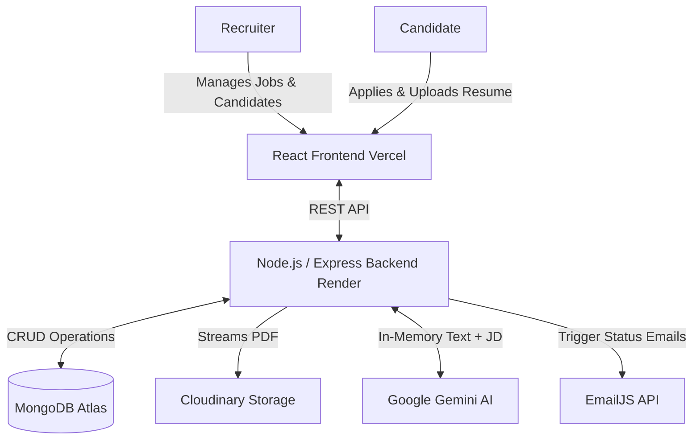

# 🚀 Zaalima: AI-Powered Applicant Tracking System (ATS)

**Live Demo:** [https://applicant-tracking-system-ats-zaali.vercel.app/](https://applicant-tracking-system-ats-zaali.vercel.app/)

## 📌 Project Overview
The Zaalima AI-Powered ATS is a modern, end-to-end recruitment platform designed to eliminate hiring bias and streamline candidate evaluation. Built for "Project 3" of the Zaalima Internship, this MERN-stack application provides a dual-role environment: Recruiters can manage job lifecycles via an interactive Kanban board, while Candidates can securely apply for roles.

The platform's standout feature is the integration of **Google Gemini AI**, which automates resume parsing and evaluates candidate qualifications against specific Job Descriptions, generating an intelligent, data-driven "Match Score".

## 🏗️ Role-Based Architecture


```mermaid
graph TD
    %% Users
    R[Recruiter] -->|Manages Jobs & Candidates| F[React Frontend Vercel]
    C[Candidate] -->|Applies & Uploads Resume| F

    %% Frontend to Backend
    F <-->|REST API| B[Node.js / Express Backend Render]

    %% Backend Integrations
    B <-->|CRUD Operations| DB[(MongoDB Atlas)]
    B -->|Streams PDF| CL[Cloudinary Storage]
    B <-->|In-Memory Text + JD| AI[Google Gemini AI]
    B -->|Trigger Status Emails| E[EmailJS API]
```

## 🛠️ Tech Stack 
* **Frontend:** React.js, Material-UI, Vite (Deployed on Vercel)
* **Backend:** Node.js, Express.js (Deployed on Render)
* **Database:** MongoDB Atlas
* **Cloud Storage:** Cloudinary (Secure resume PDF storage)
* **AI Engine:** Google Gemini AI API
* **Communication:** EmailJS (Serverless automated email notifications)

## ✨ Core Features

### For Recruiters
* **Smart Job Management:** Create, edit, and archive job postings with specific required skills and company details.
* **AI Candidate Evaluation:** Trigger the AI engine to generate a 0-100 "Match Score" with a detailed breakdown of candidate strengths and missing skills.
* **Interactive Kanban Pipeline:** Drag-and-drop candidates through stages (Applied, Reviewed, Interviewing, Offered).
* **Automated Workflow:** Moving a candidate to "Interviewing" automatically triggers an EmailJS invitation to the candidate.

### For Candidates
* **Public Job Board:** Search and filter active job postings by title, company name, or location.
* **Secure Application Portal:** Upload PDF/DOCX resumes (parsed in-memory and stored securely in the cloud).
* **Two-Way Interactive Dashboard:** Accept or Decline interview invitations and final job offers directly from the dashboard, which instantly updates the Recruiter's Kanban board.

## 🧠 How the AI Pipeline Works
To ensure maximum reliability and bypass strict cloud-storage security blocks, the AI pipeline is handled entirely in-memory:
1. Candidate uploads a PDF resume.
2. The Node.js backend intercepts the file buffer and extracts the raw text in-memory using `pdf-parse`.
3. The raw text and the target Job Description are sent to the **Google Gemini AI API** using a strict semantic prompt.
4. Gemini returns a structured JSON evaluation (Match Score & Feedback).
5. The original PDF buffer is then securely streamed to Cloudinary for permanent storage.

## 🚀 Local Setup Instructions
To run this project locally on your machine:

**1. Clone the repository:**
```bash
git clone https://github.com/AayushBarik07/Applicant-Tracking-System-ATS---Zaalima.git
```

**2. Setup Backend:**
```bash
cd server
npm install
# Create a .env file with MONGO_URI, JWT_SECRET, GEMINI_API_KEY, CLOUDINARY URLs
npm run start
```

**3. Setup Frontend:**
```bash
cd client
npm install
# Create a .env.local file with VITE_API_URL
npm run dev
```

## 📅 Progress Report: 

<details>
<summary><b>Click to expand the day-by-day breakdown</b></summary>

* **Day 1-2:** Project scoping, requirements gathering, and initializing the MERN stack environment.
* **Day 3-4:** Designing the MongoDB schemas (Users, Jobs, Applications) and setting up basic Express routes.
* **Day 5-6:** Implementing dual-role JWT authentication (Recruiters vs. Candidates) and password hashing.
* **Day 7-8:** Building the Recruiter Dashboard and REST APIs for creating, editing, and archiving job postings.
* **Day 9-10:** Developing the public-facing Job Board UI with real-time search and filtering.
* **Day 11-12:** Building the Candidate Dashboard and integrating secure routing based on user roles.
* **Day 13-14:** Setting up Cloudinary and `multer` for secure PDF resume uploads and cloud storage.
* **Day 15-16:** Overhauling the application submission pipeline to process resume data efficiently.
* **Day 17-18:** Researching and integrating the Google Gemini AI API for semantic resume analysis.
* **Day 19-20:** Building the in-memory PDF text extraction (`pdf-parse`) to feed data securely to Gemini.
* **Day 21-22:** Designing the Recruiter Kanban Board with drag-and-drop workflow capabilities.
* **Day 23-24:** Implementing EmailJS for automated, real-time interview and status notifications.
* **Day 25-26:** Building two-way interactive workflows (Candidates accepting/declining offers).
* **Day 27:** Deploying the frontend to Vercel and the backend to Render; configuring environment variables.
* **Day 28:** Final bug fixing, UI polishing, testing the production build, and completing documentation.
</details>
